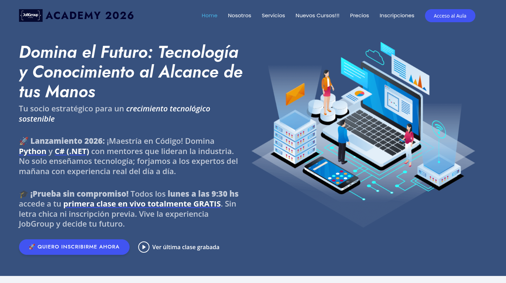
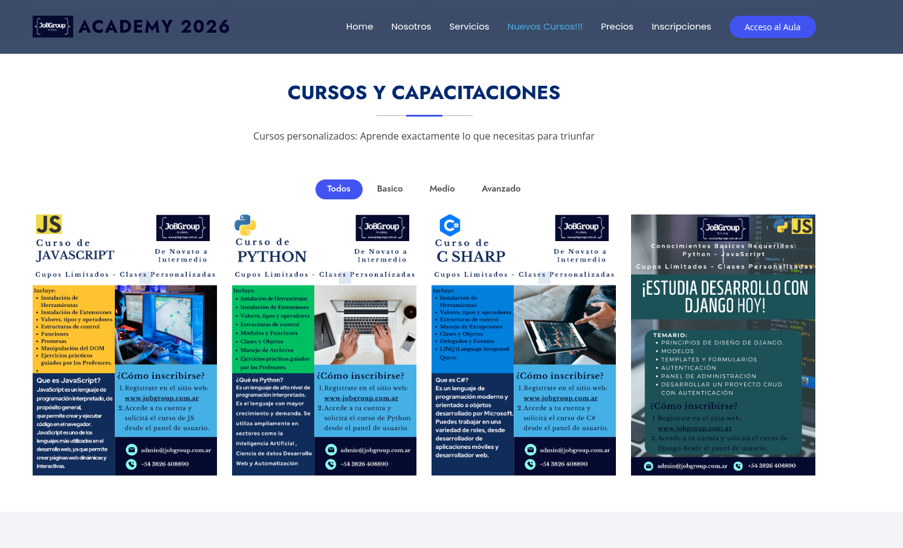
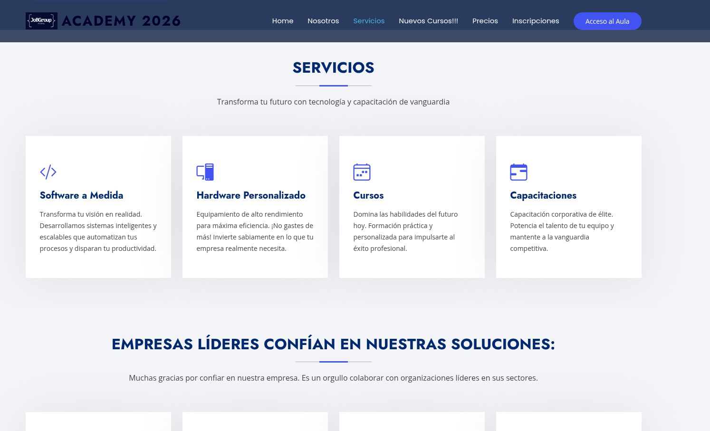

# JobGroup Platform (Portfolio Edition)

## Plataforma de Capacitación, Gestión Académica y Servicios Tecnológicos

🔗 Sitio en producción: https://jobgroup.com.ar/

---

## Descripción

JobGroup Platform es una plataforma web desarrollada para la gestión de capacitación tecnológica, administración académica y prestación de servicios vinculados al desarrollo de software.

El proyecto integra funcionalidades orientadas a la publicación de cursos, inscripción de estudiantes, administración de contenidos, gestión institucional y presentación de servicios tecnológicos.

Actualmente se encuentra funcionando en producción y forma parte del ecosistema digital de JobGroup Academy.

---

## Objetivos del Proyecto

- Centralizar la gestión académica.
- Facilitar la inscripción a cursos y capacitaciones.
- Administrar contenidos educativos.
- Presentar servicios tecnológicos y desarrollo de software.
- Escalar funcionalidades para nuevos programas de formación.

---

## Funcionalidades Principales

### Gestión Académica

- Publicación de cursos.
- Gestión de programas de capacitación.
- Inscripciones online.
- Organización de contenidos.

### Portal Institucional

- Presentación de servicios.
- Información institucional.
- Contacto con clientes y estudiantes.

### Gestión de Usuarios

- Administración de perfiles.
- Gestión de accesos.
- Organización de información académica.

### Escalabilidad

Diseñado para incorporar nuevos módulos vinculados a:

- Aula virtual.
- Gestión documental.
- Certificaciones.
- Seguimiento académico.
- Integración con herramientas de IA.

---

## Stack Tecnológico

### Backend

- Python
- Django

### Frontend

- JavaScript
- HTML5
- CSS3

### Base de Datos

- PostgreSQL

### Infraestructura

- Docker
- Linux

---

## Arquitectura

El sistema fue diseñado utilizando una arquitectura basada en aplicaciones desacopladas, priorizando:

- mantenibilidad,
- modularidad,
- escalabilidad,
- reutilización de componentes.

### Componentes principales

- Frontend Web
- Backend Django
- PostgreSQL
- Servicios de autenticación
- Gestión de contenidos
- Administración académica

---

## Capturas

### Página principal

### Cursos

### Servicios

---

## Mi Rol

Responsable del:

- Análisis de requerimientos.
- Diseño de arquitectura.
- Modelado de base de datos.
- Desarrollo backend.
- Desarrollo frontend.
- Implementación y despliegue.
- Evolución funcional del sistema.

---

## Tecnologías Aplicadas

- Ingeniería de Software
- Arquitectura de Software
- Modelado UML
- Bases de Datos Relacionales
- Desarrollo Web Full Stack

---

## Estado del Proyecto

Proyecto activo y en evolución continua.

---

## Autor

Cristian Tomás Britos

Licenciado en Análisis de Sistemas  
Full Stack Developer  
Profesor Universitario

GitHub:
https://github.com/cristianbritos
